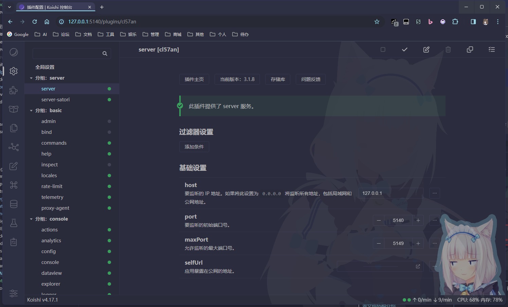
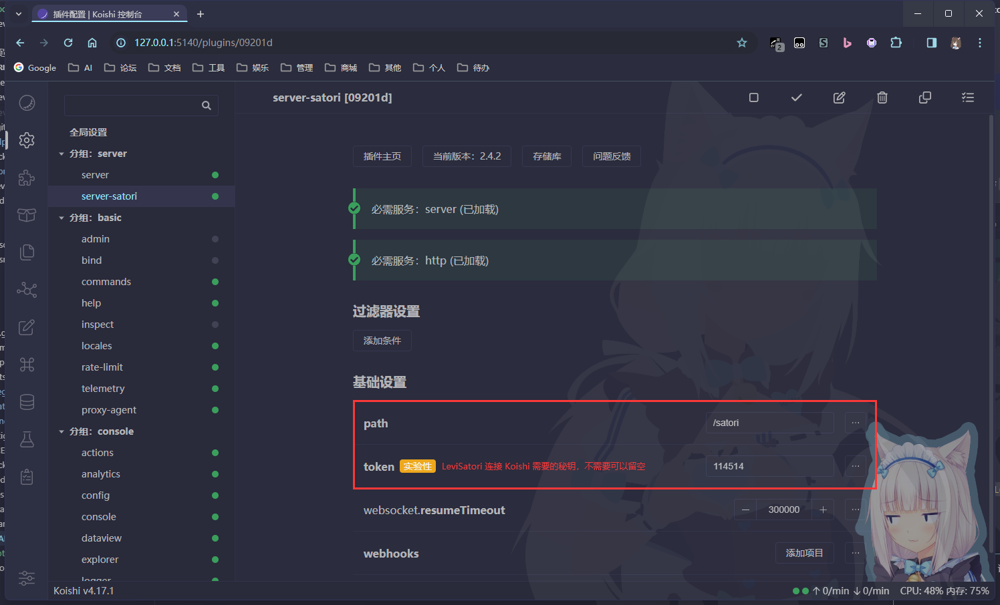
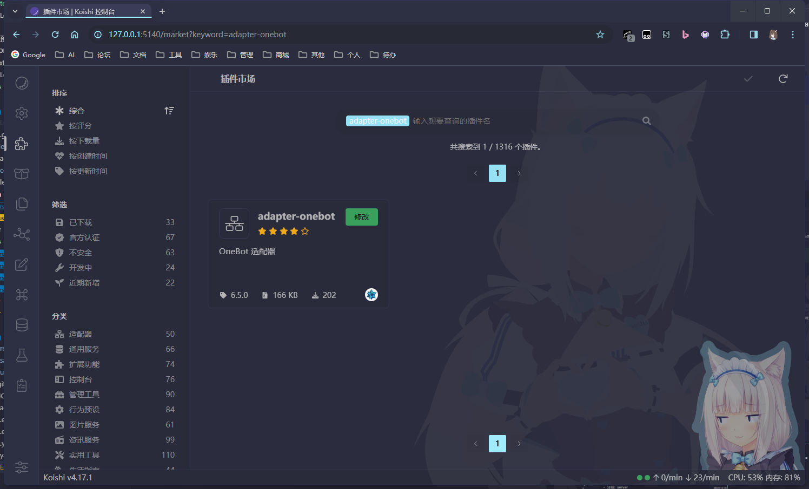
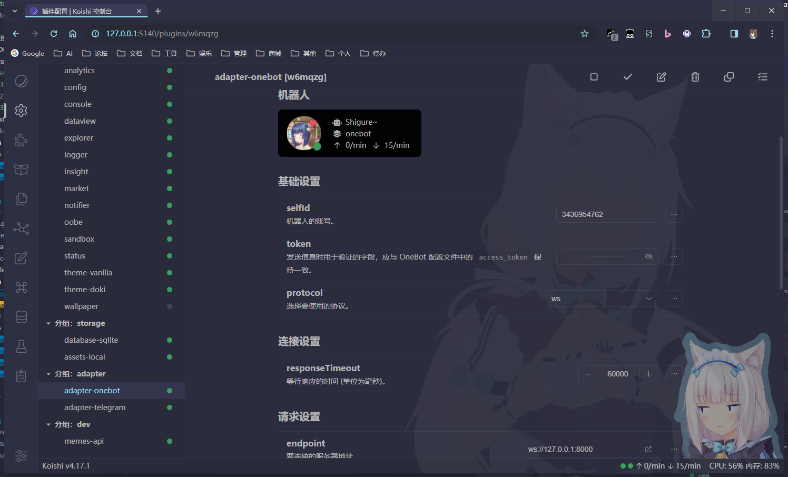
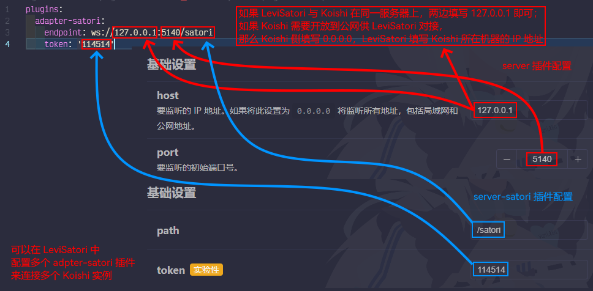
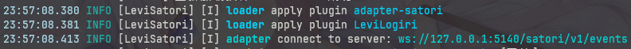

<!-- markdownlint-disable MD033 -->

# LeviSatori

使用 [Satori](https://satori.chat/) 协议与各聊天平台进行交互吧！

## 安装 & 配置

### 配置文件结构介绍

配置文件采用 yml 格式，如果不熟悉此格式建议先去看教程，比如 [这个](https://www.ruanyifeng.com/blog/2016/07/yaml.html)

```yml
# 目前 LeviSatori 仅有 logger 与 plugins 两个配置项

# logger 配置项用于配置 LeviSatori 的日志输出，可以省略
# 参见 https://koishi.chat/zh-CN/api/utils/logger.html
logger:
  levels: 2

# plugins 配置项用于配置 leviSatori 要加载的插件列表，
# 及定义加载的插件的配置项
plugins:
  # 键名为要加载的插件名
  # 有的插件可以加载多次（可重用），一般 adapter 都是可重用的
  # 这里的 adapter-satori 是 LeviSatori 中的内置插件，下文会介绍
  adapter-satori:
    # 内容是插件的配置项，这部分配置取决于插件
    endpoint: 'ws://127.0.0.1:5140/satori'
  # 同上
  LeviLogiri: {}
```

下面以 Koishi 作为 Satori SDK 来介绍 LeviSatori 的连接配置，也可以对接其他 Satori SDK，这里不再赘述

### 1. 安装 LeviSatori

```bash
lip install github.com/lgc-LLDev/LeviSatori
```

### 2. 安装与配置 Koishi 使其准备好与 LeviSatori 连接

参考 [这篇文章](https://koishi.chat/zh-CN/manual/starter/windows.html) 安装 Koishi

遇到问题可以去 [这里](https://koishi.chat/zh-CN/about/contact.html) 讨论  
OneBot / Red 等关于 QQ 的第三方适配器相关问题请去 [这里](http://qm.qq.com/cgi-bin/qm/qr?_wv=1027&k=lZE4CgRZdbymqEPVZ3R5brtDtvcKeX-V&authKey=WKvofk7Mt%2FoQ06kT1375dMOXLXqHwIkfahXHIsundXYS9gDYhhxhLjiI%2FIaYRbNQ&noverify=0&group_code=590104798)，**请不要在 Koishi 官方用户群讨论相关问题！**

根据你的需求配置 `server` 插件  


启用 `server-satori` 插件并根据需要配置好 `path` 与 `token` 项  


启用与配置你想要对接的聊天平台的 `adapter` 插件（`adapter-onebot` 已转为社区插件，请到插件市场中搜索安装）  
  


### 3. 配置 LeviSatori 与 Satori SDK 的连接

先启动一次服务器，LeviSatori 会在插件文件夹下生成一个配置文件 `LeviSatori.yml`，其格式请看上文 [配置文件结构介绍](#配置文件结构介绍)

按照下图配置 LeviSatori 中的 `adapter-satori` 插件



### 4. 启动 LeviLamina 检查是否与 Satori SDK 正常连接

LeviSatori 会在服务器成功启动时启动服务，检查日志输出即可



### 5. 给 LeviSatori 安装插件

如果想给 LeviSatori 安装插件，请参考各插件的文档，不过一般来说，对于单文件插件，只需要将其放入 LeviSatori 的插件文件夹 `./plugins/LeviSatori/plugins` 下，然后在 LeviSatori 的配置文件中添加相应的配置项即可

## 本体 / 插件开发相关

### 环境配置

```bash
git clone https://github.com/lgc-LLDev/LeviSatori --depth=1 --recursive
cd LeviSatori
yarn
yarn build
```

### 插件开发

在 external 文件夹新建一个 nodejs 项目即可，项目配置与写法可以参考 [LeviLogiri](https://github.com/lgc-LLDev/LeviLogiri)

关于插件结构，可以参考 [Koishi 文档](https://koishi.chat/zh-CN/guide/plugin) 的模块化一节  
关于跨平台开发，可以参考 [Koishi 文档](https://koishi.chat/zh-CN/guide/adapter/) 的跨平台一节  
关于配置定义，可以参考 [Schemastery 文档](https://shigma.github.io/schemastery/meta/description.html)

## 联系我

QQ：3076823485  
吹水群：[1105946125](https://jq.qq.com/?_wv=1027&k=Z3n1MpEp)  
邮箱：<lgc2333@126.com>

## 鸣谢

## [Koishi](https://koishi.chat/zh-CN/)，以及 Koishi 的依赖库 [Cordis](https://github.com/cordiverse/cordis) 与 [Satori](https://github.com/satorijs/satori)

没有它们，LeviSatori 就不会出现！

## 赞助

感谢大家的赞助！你们的赞助将是我继续创作的动力！

- [爱发电](https://afdian.net/@lgc2333)
- <details>
    <summary>赞助二维码（点击展开）</summary>

  

  </details>

## 更新日志

暂无
